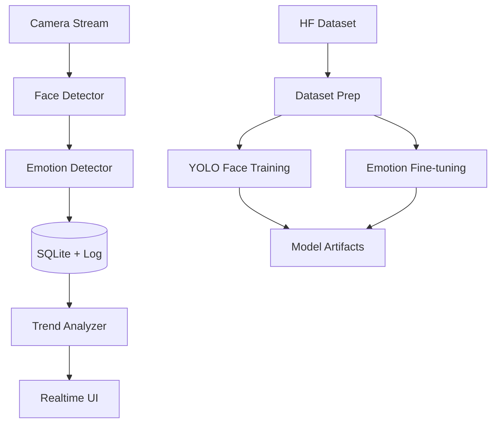

<div align="center">

# EmotiSense

Training-and-inference toolkit for real-time facial emotion understanding.

[](https://www.python.org/)
[](https://docs.astral.sh/uv/)
[](https://github.com/ultralytics/ultralytics)
[](https://pytorch.org/)
[](https://github.com/sudo-yf/Test2504/actions)
[](LICENSE)

</div>

## Overview

EmotiSense 提供从数据下载、模型训练、情绪分类微调到实时推理与日志分析的完整闭环，适用于课程实践、模型验证、竞赛原型与研究型工程开发。

## Table of Contents

- [Overview](#overview)
- [Core Capabilities](#core-capabilities)
- [System Architecture](#system-architecture)
- [Quick Start](#quick-start)
  - [1. Installation](#1-installation)
  - [2. Data Preparation](#2-data-preparation)
  - [3. Training](#3-training)
  - [4. Inference](#4-inference)
  - [5. Quality Gates](#5-quality-gates)
- [GPU Requirements](#gpu-requirements)
- [Project Structure](#project-structure)
- [Documentation](#documentation)
- [Design References](#design-references)

## Core Capabilities

- 实时人脸检测与情绪识别
- 多模型情绪引擎（DeepFace / HSEmotion / FER / Ensemble）
- 高频事件记录与 SQLite 持久化
- Hugging Face 数据集下载脚本与 CLI 命令
- YOLO 系列人脸检测训练（含 YOLOv26/face 变体）
- 基于 timm + PyTorch 的情绪分类微调
- Docker + uv + CI 的可复现实验环境

## System Architecture



## Quick Start

### 1. Installation

Use uv:

```bash
uv sync
cp .env.example .env
```

Install training extras:

```bash
uv sync --extra train --extra models --extra dev
```

Use Docker:

```bash
docker compose build
docker compose run --rm emotisense
```

### 2. Data Preparation

Download FER2013 with HF CLI:

```bash
uv run --extra train hf download mrm8488/fer2013 \
  --repo-type dataset \
  --local-dir data/raw/fer2013
```

Download with built-in script:

```bash
uv run python scripts/download_datasets.py --preset fer2013 --local-dir data/raw
```

Download custom dataset repo:

```bash
uv run python scripts/download_datasets.py \
  --repo-id your-org/your-emotion-dataset \
  --repo-type dataset \
  --local-dir data/raw
```

### 3. Training

Train YOLO family face detector:

```bash
uv run python scripts/train_yolo_face.py \
  --model yolov26n.pt \
  --data configs/datasets/face_detection.yaml \
  --epochs 100 \
  --device 0
```

Fine-tune emotion classifier:

```bash
uv run python scripts/finetune_emotion.py \
  --data-root data/processed/emotion_cls \
  --model resnet18 \
  --num-classes 7 \
  --epochs 20 \
  --device cuda
```

### 4. Inference

Run application:

```bash
uv run python main.py
```

Compare detectors:

```bash
uv run python scripts/compare_models.py --mode webcam --duration 30
```

### 5. Quality Gates

```bash
make lint
make test
make check
```

## GPU Requirements

- 训练建议 NVIDIA GPU + CUDA
- YOLO 人脸检测训练：8GB+ 显存
- 情绪分类微调：8GB+ 显存
- 多模型并行实验：12GB+ 显存
- CPU 支持推理，但吞吐低于 GPU

## Project Structure

```text
Test2504/
├── src/emotisense/
├── scripts/
├── configs/
├── docs/
├── tests/
├── data/
├── main.py
├── config.yaml
├── pyproject.toml
├── Dockerfile
├── docker-compose.yml
└── LICENSE
```

## Documentation

- [Installation](docs/installation.md)
- [Datasets](docs/datasets.md)
- [Training](docs/training.md)
- [GPU Requirements](docs/gpu_requirements.md)
- [Policy / Evaluation](docs/policy_eval.md)
- [Advanced Models](docs/ADVANCED_MODELS.md)
- [Model Internals](docs/MODELS_IMPLEMENTATION.md)

## Design References

- [Ultralytics](https://github.com/ultralytics/ultralytics)
- [DeepFace](https://github.com/serengil/deepface)
- [Hugging Face Hub](https://github.com/huggingface/huggingface_hub)
- [timm](https://github.com/huggingface/pytorch-image-models)

