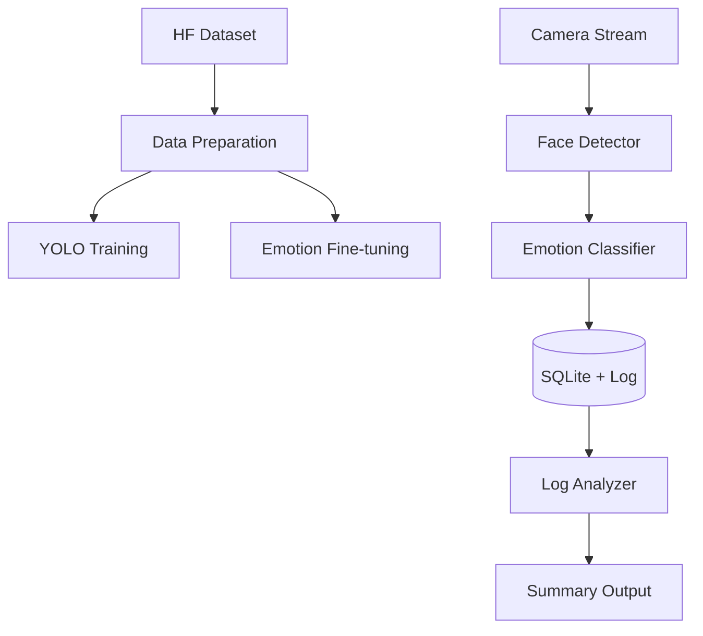

<div align="center">

# EmotiSense

聚焦模型训练、实时检测与日志分析的情绪感知工程

[](https://www.python.org/)
[](https://docs.astral.sh/uv/)
[](https://github.com/ultralytics/ultralytics)
[](https://pytorch.org/)
[](https://github.com/sudo-yf/Test2504/actions)
[](LICENSE)

</div>

## 项目定位

本项目只聚焦三件事：

- 模型训练（YOLO 人脸检测 + 情绪分类微调）
- 实时检测（摄像头输入、实时情绪识别）
- 日志分析（高置信度事件记录、统计与趋势分析）

## 核心能力

- YOLO 系列训练（支持 YOLOv26 / face 变体）
- 基于 timm + PyTorch 的情绪分类 Fine-tuning
- 实时人脸检测与情绪识别主流程
- SQLite + 日志文件双通道记录
- 退出阶段自动汇总统计并输出分析结果

## 系统架构



## 快速开始

### 1. 安装依赖

```bash
uv sync
cp .env.example .env
```

训练依赖：

```bash
uv sync --extra train --extra models --extra dev
```

### 2. 数据集下载

Hugging Face CLI：

```bash
uv run --extra train hf download mrm8488/fer2013 \
  --repo-type dataset \
  --local-dir data/raw/fer2013
```

项目脚本：

```bash
uv run python scripts/download_datasets.py --preset fer2013 --local-dir data/raw
```

### 3. 模型训练

YOLO 人脸检测训练：

```bash
uv run python scripts/train_yolo_face.py \
  --model yolov26n.pt \
  --data configs/datasets/face_detection.yaml \
  --epochs 100 \
  --device 0
```

情绪分类微调：

```bash
uv run python scripts/finetune_emotion.py \
  --data-root data/processed/emotion_cls \
  --model resnet18 \
  --num-classes 7 \
  --epochs 20 \
  --device cuda
```

### 4. 实时检测

```bash
uv run python main.py
```

### 5. 运行前自检与离线报告

运行前自检（配置、数据库、日志路径、摄像头）：

```bash
uv run python main.py doctor --check-camera
```

离线生成分析报告（从现有数据库和日志）：

```bash
uv run python main.py report --mode offline
```

### 6. 质量检查

```bash
make lint
make test
make check
```

## 日志分析

- 运行时记录高置信度情绪事件
- 数据写入 SQLite 与文本日志
- 退出阶段自动导出 JSON/Markdown 报告到 `outputs/reports`
- 支持离线 `report` 命令复用已有数据生成报告

详见：[日志分析说明](docs/log_analysis.md)

## GPU 建议

- YOLO 训练：8GB+ VRAM
- Fine-tuning：8GB+ VRAM
- 大 batch 或多模型实验：12GB+ VRAM

## 容器运行

```bash
make docker-build
make docker-run
```

## 发布打包

```bash
make release-bundle
```

## 目录结构

```text
Test2504/
├── src/emotisense/
├── scripts/
├── configs/
├── docs/
├── tests/
├── main.py
├── config.yaml
├── pyproject.toml
├── Dockerfile
├── docker-compose.yml
└── LICENSE
```

## 文档

- [安装指南](docs/installation.md)
- [数据集指南](docs/datasets.md)
- [训练指南](docs/training.md)
- [GPU 要求](docs/gpu_requirements.md)
- [日志分析](docs/log_analysis.md)
- [产品战略](docs/PRODUCT_STRATEGY.md)
- [Roadmap](docs/ROADMAP.md)
- [贡献指南](CONTRIBUTING.md)
