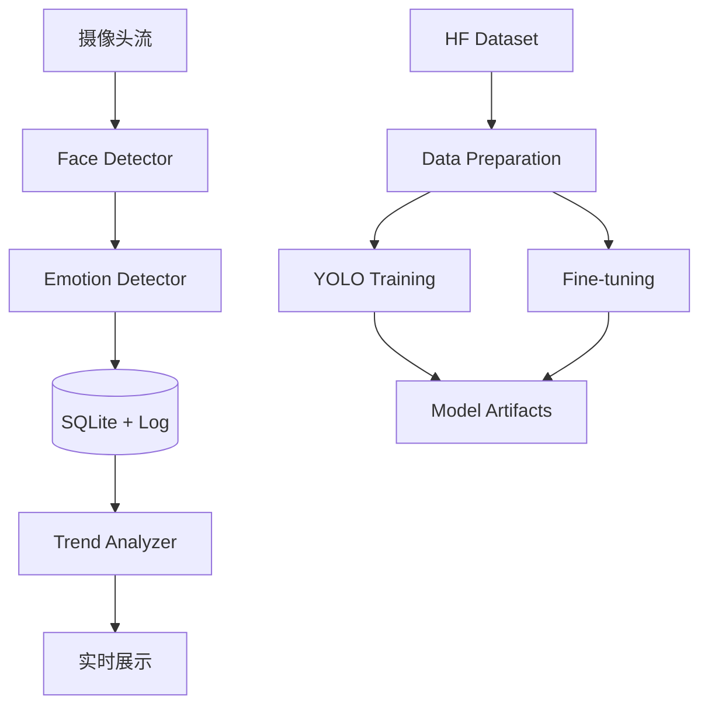

<div align="center">

# EmotiSense

面向情绪感知任务的训练与实时推理一体化工程

[](https://www.python.org/)
[](https://docs.astral.sh/uv/)
[](https://github.com/ultralytics/ultralytics)
[](https://pytorch.org/)
[](https://github.com/sudo-yf/Test2504/actions)
[](LICENSE)

</div>

## 项目简介

EmotiSense 将数据下载、模型训练、情绪分类微调、实时检测、日志分析整合为统一工作流，适用于课程实践、竞赛方案验证、模型迭代与工程化部署。

## 核心能力

- 实时人脸检测与情绪识别
- 多检测后端（DeepFace / HSEmotion / FER / Ensemble）
- 高频情绪事件记录与 SQLite 持久化
- Hugging Face 数据集下载（CLI + Script）
- YOLO 系列人脸检测训练（支持 YOLOv26 与 face 变体）
- timm + PyTorch 情绪分类微调
- Docker + uv + CI 的可复现环境

## 系统架构



## 快速开始

### 1. 安装依赖

```bash
uv sync
cp .env.example .env
```

训练依赖：

```bash
uv sync --extra train --extra models --extra dev
```

### 2. 下载数据集

使用 Hugging Face CLI：

```bash
uv run --extra train hf download mrm8488/fer2013 \
  --repo-type dataset \
  --local-dir data/raw/fer2013
```

使用项目脚本：

```bash
uv run python scripts/download_datasets.py --preset fer2013 --local-dir data/raw
```

自定义数据集仓库：

```bash
uv run python scripts/download_datasets.py \
  --repo-id your-org/your-emotion-dataset \
  --repo-type dataset \
  --local-dir data/raw
```

### 3. 模型训练

YOLO 系列人脸检测训练：

```bash
uv run python scripts/train_yolo_face.py \
  --model yolov26n.pt \
  --data configs/datasets/face_detection.yaml \
  --epochs 100 \
  --device 0
```

情绪分类微调：

```bash
uv run python scripts/finetune_emotion.py \
  --data-root data/processed/emotion_cls \
  --model resnet18 \
  --num-classes 7 \
  --epochs 20 \
  --device cuda
```

### 4. 实时推理

```bash
uv run python main.py
```

模型对比：

```bash
uv run python scripts/compare_models.py --mode webcam --duration 30
```

### 5. 质量检查

```bash
make lint
make test
make check
```

## 容器部署

```bash
make docker-build
make docker-run
```

## GPU 建议

- 训练建议 NVIDIA GPU + CUDA
- YOLO 训练：8GB+ 显存
- 微调训练：8GB+ 显存
- 多模型实验：12GB+ 显存
- CPU 可运行推理，但吞吐较低

## 目录结构

```text
Test2504/
├── src/emotisense/
├── scripts/
├── configs/
├── docs/
├── tests/
├── data/
├── main.py
├── config.yaml
├── pyproject.toml
├── Dockerfile
├── docker-compose.yml
└── LICENSE
```

## 文档索引

- [安装指南](docs/installation.md)
- [数据集指南](docs/datasets.md)
- [训练指南](docs/training.md)
- [GPU 要求](docs/gpu_requirements.md)
- [评测说明](docs/policy_eval.md)
- [高级模型](docs/ADVANCED_MODELS.md)
- [实现说明](docs/MODELS_IMPLEMENTATION.md)

## 参考项目

- [Ultralytics](https://github.com/ultralytics/ultralytics)
- [DeepFace](https://github.com/serengil/deepface)
- [Hugging Face Hub](https://github.com/huggingface/huggingface_hub)
- [timm](https://github.com/huggingface/pytorch-image-models)

